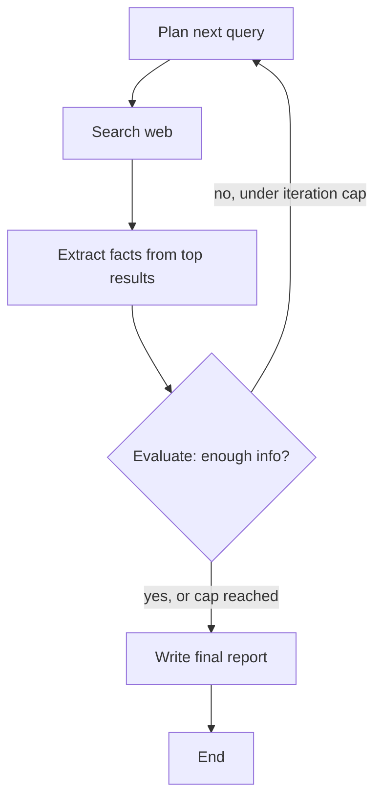

# Research & Report Agent

An autonomous research agent built with **LangGraph**. Give it a topic, and it:

1. **Plans** a search query targeting the biggest gap in its current knowledge
2. **Searches** the web for that query
3. **Extracts** and summarizes facts from the top results
4. **Evaluates** whether it now knows enough to write a good report
5. Loops back to step 1 if not (up to a max iteration limit), or **writes** a final structured report

This demonstrates core agentic AI concepts: multi-step planning, tool use, self-evaluation, and looping/branching control flow — not just a single LLM call wrapped in a UI.

## Architecture



## Tech stack

| Layer | Choice |
|---|---|
| Orchestration | LangGraph (state machine with conditional loop) |
| LLM | Qwen 3.8 Omni Flash (free tier), via any OpenAI-compatible endpoint |
| Search tool | Tavily API (falls back to DuckDuckGo scraping if no key set) |
| Page reading | `requests` + `BeautifulSoup` |
| UI | Streamlit |

## Setup

1. **Install dependencies**
   ```bash
   pip install -r requirements.txt
   ```

2. **Configure your LLM backend**

   Copy `.env.example` to `.env` and fill in your values:
   ```bash
   cp .env.example .env
   ```

   The default backend is the **Xkiro** OpenAI-compatible gateway (free Qwen tier):
   ```
   LLM_BASE_URL=https://api.xkiro.com/v1
   LLM_MODEL=qwen/qwen3.8-omni-flash:free
   LLM_API_KEY=sk-your-key-here
   ```

   For a **local model via Ollama**:
   ```bash
   ollama pull qwen2.5:3b
   ollama serve
   ```
   Then in `.env`:
   ```
   LLM_BASE_URL=http://localhost:11434/v1
   LLM_MODEL=qwen2.5:3b
   LLM_API_KEY=ollama
   ```

   Any other OpenAI-compatible provider (DashScope, vLLM, LM Studio, ...) works
   the same way — just set `LLM_BASE_URL`, `LLM_MODEL`, and `LLM_API_KEY`.

3. **(Recommended) Get a free Tavily API key** at [tavily.com](https://tavily.com) and set `TAVILY_API_KEY` in `.env`. Without it, the agent falls back to scraping DuckDuckGo's HTML results, which works but is noisier.

4. **Run the CLI version** (good for quick testing):
   ```bash
   python agent.py
   ```

5. **Run the web UI**:
   ```bash
   streamlit run app.py
   ```

## Deploying

- **Hugging Face Spaces**: create a Space with the Streamlit SDK, push these files, add your `.env` values as Space secrets.
- **Render / Railway**: use a "Web Service" with start command `streamlit run app.py --server.port $PORT --server.address 0.0.0.0`.

## Project structure

```
research_agent/
├── agent.py         # LangGraph state machine (the actual agent logic)
├── app.py           # Streamlit UI
├── llm_client.py    # OpenAI-compatible chat client wrapper
├── tools.py         # web_search() and read_url() tools
├── config.py         # all configuration (env-driven)
├── requirements.txt
├── .env.example
└── README.md
```

## Ideas to extend this further

- Add a **vector store (Chroma)** so the agent remembers facts across sessions, not just within one run
- Add a **calculator or code-execution tool** for topics needing computation
- Add a **critic node** that reviews the draft report before finalizing it
- Swap the fixed iteration cap for a token/cost budget
- Add source citations inline in the report, linked to the URLs gathered

## Notes on model choice

The planning and evaluation steps require the LLM to return strict JSON, which small
models sometimes wrap in prose or code fences — `llm_client.chat_json()` retries once
with a stricter instruction when that happens. If you see repeated JSON failures, lower
`LLM_TEMPERATURE` in `.env`, or use a larger model for those two nodes.

Model IDs on the Xkiro gateway are namespaced and free variants carry a `:free` suffix
(`qwen/qwen3.8-omni-flash:free`). Run `curl https://api.xkiro.com/v1/models` to list exact
IDs — an unrecognised name fails on the first call.
