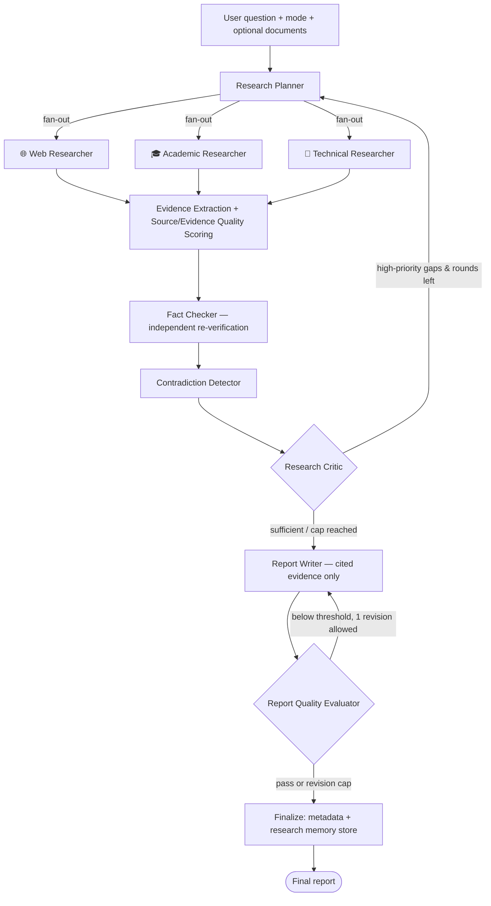

# Research Intelligence Agent

**An evidence-driven, multi-agent deep research system built with LangGraph.**

Give it a question. It plans subquestions, researches the web / academic /
technical angles **in parallel**, scores source quality, extracts verbatim-
verified evidence, independently fact-checks its own claims, detects and
explains contradictions between sources, reflects on research gaps and
re-researches them, and writes a report where **every factual claim is traceable
to a retrieved source**.

> **Why this is an agentic system, not a chatbot:** a chatbot answers from
> weights. This agent *decides*: what to search, when a source is untrustworthy,
> when evidence conflicts, when it doesn't know enough yet (and loops to fix
> that), and when its own draft report fails quality thresholds. All control
> flow is a LangGraph state machine with bounded self-reflection loops —
> plus hard iteration caps so every run terminates.

---

## 1. Problem statement

LLM chatbots hallucinate citations, can't say "I couldn't verify this," and
quietly pick one source when two disagree. Generic "search + summarize" demos
inherit all of this. Real research work needs **provenance, skepticism, and
self-critique** — which is exactly what agent orchestration is for.

## 2. Features

- 🔀 **True parallel research** — web / academic / technical researchers run as a LangGraph fan-out superstep, each with its own state channel
- 🧾 **Structured evidence model** — typed Pydantic objects (Evidence, Source, Claim, Contradiction, Gap…), not loose notes
- 🛡️ **Anti-fabrication extraction** — extracted passages are verified to actually appear in the fetched text; unverifiable quotes are demoted to *unsupported*
- 📊 **Source quality system** — authority tiers (gov/edu/standards/primary research up; content farms down), recency, relevance, primary-source status, cross-source agreement → one normalized score
- 🔍 **Independent fact checker** — re-searches each important claim and judges it *against* the original researcher, including a fresh "unverifiable" verdict
- ⚡ **Contradiction detection** — conflicting claims become first-class objects with possible reasons (versions, hardware, methodology, dates); never silently resolved
- 🧐 **Research critic + bounded reflection loop** — high-priority gaps route the graph back through research, up to a hard round limit
- 📏 **Report quality gate** — evidence coverage / citation coverage / source quality / question coverage metrics; failing reports get exactly one revision pass
- 🧠 **Optional persistent research memory** — Chroma-backed store/reuse of prior evidence across sessions; fully graceful when unavailable
- 📄 **Document research** — upload PDF/TXT/Markdown; uploaded evidence is clearly labeled and kept distinct from web evidence
- 🎛 **7 research modes** sharing one workflow (configurable prompts + report schemas)
- 🖥️ **Professional Streamlit UI** — live agent trace, per-node status, metrics, expandable evidence/fact-check/contradiction/gap views (action summaries only — no chain-of-thought)
- ⬇️ **Exports** — Markdown report + full JSON evidence dataset
- 🧵 **Structured logging & observability** — node timings, LLM call/token estimates, retry counts, quality scores (never secrets)
- ✅ **39 tests** with mocked LLM/search — no API keys required

## 3. Architecture



Uploaded documents enter at **Evidence Extraction**, tagged `user_document`.
When memory is enabled, prior-session evidence is recalled at the same point,
tagged `previous_research`.

## 4. Agent workflow (what actually runs)

| Stage | Node | Kind | What it does |
|---|---|---|---|
| 1 | `plan` | LLM (T=0) | Decompose question into subquestions; assign each a focused query and a researcher. Later rounds target critic-identified gaps only. |
| 2 | `web_researcher` / `academic_researcher` / `technical_researcher` | Tools, **parallel** | Tavily→DuckDuckGo web search, Semantic Scholar (with scholarly-web fallback), docs-flavored search. Deep-read a bounded number of pages each. |
| 3 | `evidence` | LLM (T=0) + deterministic | Merge/dedupe sources into a scored registry; extract `{claim, passage, confidence}` per source; **verify quoted passages are verbatim**; fold in uploads + memory; enforce hard caps. |
| 4 | `fact_check` | Tools + LLM | Fresh independent search per claim → supported / partially_supported / contradicted / unverifiable. |
| 5 | `contradictions` | LLM | Genuine cross-source conflicts with possible reasons; agreement feeds back into source quality. |
| 6 | `critic` | LLM + deterministic | Sufficiency verdict + structured gaps (importance, recommended query). Bounded loop back to planner. |
| 7 | `writer` | LLM | Mode-shaped Markdown report, inline `[S#]` citations only; **Sources section is appended from the real registry**, so URLs can't be hallucinated. |
| 8 | `evaluate` | Deterministic + LLM | Quality metrics; one bounded revision on failure. |
| 9 | `finalize` | — | ReportMetadata, stats, optional memory persistence. |

## 5. Technology stack

| Layer | Choice |
|---|---|
| Orchestration | LangGraph (conditional fan-out, reducers, bounded reflection loops) |
| Data model | Pydantic v2 typed research objects |
| LLM | Any OpenAI-compatible endpoint (default: Qwen free tier; Ollama / LM Studio / vLLM / DashScope supported) |
| Search | Tavily API → DuckDuckGo fallback; Semantic Scholar academic API |
| Docs | pypdf / plain text / Markdown ingestion |
| Memory (optional) | ChromaDB persistent vector store |
| UI | Streamlit |
| Tests | pytest with fully mocked LLM/search (no keys needed) |

## 6. Installation

```bash
git clone https://github.com/kareemtarek20/research-report-agent
cd research-report-agent
pip install -r requirements.txt        # or just double-click run.bat
```

Memory is enabled by default once configured: set `ENABLE_MEMORY=true` in `.env`
(chromadb ships in `requirements.txt`; if the vector store is unavailable the
agent degrades gracefully).

## 7. Configuration

Copy `.env.example` to `.env`:

```bash
cp .env.example .env
```

| Variable | Purpose |
|---|---|
| `LLM_BASE_URL` / `LLM_MODEL` / `LLM_API_KEY` | Any OpenAI-compatible provider. Local example: `http://localhost:11434/v1`, `qwen2.5:3b`, `ollama` |
| `LLM_TEMPERATURE` / `LLM_TEMP_PRECISE` | General vs deterministic (0.0) temperature — planning, extraction, fact-checking always use the precise setting |
| `TAVILY_API_KEY` | Optional; without it DuckDuckGo fallback is used |
| `SEMANTIC_SCHOLAR_API_KEY` | Optional; academic search works keyless |
| `MAX_RESEARCH_ROUNDS`, `MAX_SOURCES`, `MAX_TOTAL_EVIDENCE`, `MAX_FACT_CHECKS`, `MAX_REPORT_REVISIONS` | Hard limits guaranteeing termination |
| `QUALITY_*` | Report gate thresholds |
| `ENABLE_MEMORY`, `MEMORY_DIR` | Persistent research memory |
| `LOG_LEVEL`, `LOG_FILE` | Structured logging |

## 8. Usage

```bash
streamlit run app.py     # full UI (recommended) — or run.bat on Windows
python agent.py          # CLI mode selector + live trace + report to stdout
```

## 9. Research modes

One workflow; modes change planner guidance, active researchers, depth limits,
fact-check intensity, and the report schema (no duplicated graphs):

`quick` · `deep` · `academic` (literature review) · `technical` (docs &
benchmarks) · `competitive` (comparison matrix) · `fact_check` (verdict-first) ·
`gap_analysis` (maps what's missing)

## 10. Example research run

> **Mode:** Deep Research
> **Question:** *"What VRAM is required to run 7B-parameter LLMs locally, and how do quantization methods change that?"*

Expected behavior (all visible in the UI trace):

1. Planner emits ~6 subquestions across web/academic/technical angles
2. Researchers search in parallel → ~10–20 sources deduped and scored (an `arxiv.org` paper lands in *high* tier; a content-farm post in *weak*)
3. Evidence extraction yields claims like *"4-bit quantized 7B models fit in ~8GB VRAM [S3]"* with verbatim-verified passages
4. Fact checker re-searches the top claims independently
5. Contradiction detector flags e.g. *"8GB required"* vs *"12GB required"* and lists reasons (quantization format, KV-cache size, different llama.cpp versions)
6. Critic notes missing low-VRAM benchmark data → one extra research round
7. Report arrives with sections *Executive Summary → Key Findings → Conflicting Evidence → Limitations → Research Gaps → Sources*, and quality metrics (evidence/citation/source-quality/question coverage)

## 11. Evidence model

Every `Evidence` object carries: `claim`, `supporting_text`,
`supporting_passage` (verbatim quote), `source_id` / `source_title` /
`source_url`, `source_type` (`web | academic | technical | user_document |
previous_research`), `publication_date`, `author`, `relevance_score`,
`authority_score`, `recency_score`, `confidence`, `supported`.

Companion types: `ResearchTask`, `ResearchSource`, `FactCheckResult`,
`Contradiction`, `ResearchGap`, `ResearchAssessment`, `ReportQuality`,
`ReportMetadata` — all in [`graph/state.py`](graph/state.py), all included in
the JSON export so **every report claim is machine-traceable**.

Integrity rules enforced in code:
- quoted passages are checked against the fetched text; unverifiable → `supported=false`
- the Sources section is generated from the registry — the LLM never writes URLs
- citation ids in the report are validated to exist in the registry (tested)

## 12. Project layout

```
research-report-agent/
├── agent.py                    # CLI entry
├── app.py                      # Streamlit UI
├── config.py                   # env-driven configuration & hard limits
├── llm_client.py               # OpenAI-compatible client: retries, JSON recovery, usage meter
├── logging_setup.py            # structured logging, node timers
├── graph/
│   ├── state.py                # Pydantic research objects + LangGraph state (reducers)
│   ├── routing.py              # conditional edges (fan-out, gap loop, revision gate)
│   └── workflow.py             # the compiled LangGraph + streaming run_agent()
├── agents/
│   ├── planner.py              # subquestion decomposition
│   ├── base_researcher.py      # shared search/read engine
│   ├── web_researcher.py  academic_researcher.py  technical_researcher.py
│   ├── evidence_agent.py       # extraction + scoring convergence node
│   ├── fact_checker.py         # independent verification
│   ├── contradiction_agent.py
│   ├── critic.py               # gap detection & reflection
│   ├── writer.py               # cited report generation + revision
│   └── report_critic.py        # quality gate
├── research/                   # sources registry, scoring, evidence, contradictions, modes
├── memory/vector_store.py      # optional Chroma research memory
├── tools/                      # web_search, academic_search, url_reader, document_loader
└── tests/                      # 39 tests, fully mocked (no API keys)
```

## 13. Screenshots

*(placeholder: main UI with mode selector and live agent trace)*
*(placeholder: evidence & fact-check expanders)*
*(placeholder: report with inline [S#] citations and quality metrics)*

## 14. Testing

```bash
pip install pytest
pytest tests/ -q        # 39 passed — no Tavily/LLM keys or network needed
```

Coverage: JSON extraction edge cases, source scoring, dedup/ID stability,
anti-fabrication passage verification, contradiction/agreement logic,
routing (fan-out selection, gap-loop bounds, revision cap), full mocked
end-to-end runs, citation traceability, search/LLM failure degradation,
document upload labeling, evidence caps, memory fallback.

## 15. Deploying

- **Hugging Face Spaces**: Streamlit SDK, push files, add `.env` values as secrets.
- **Render / Railway**: Web Service, `streamlit run app.py --server.port $PORT --server.address 0.0.0.0`.

## 16. Design notes

- **Never fabricates**: evidence passages are string-verified, sources are
  registry-generated, citations are validated. If it can't verify, it reports
  *unverifiable* — that's a feature, not a failure.
- **Always terminates**: every self-reflection loop is bounded (research
  rounds, sources, evidence, fact checks, revisions). No LLM verdict can
  produce an infinite run.
- **Degrades gracefully**: dead pages, failed searches, malformed JSON and a
  missing vector DB all downgrade parts of the run — never kill it. The final
  report states its own limitations.
- **No chain-of-thought exposure**: the UI shows action summaries and
  observable artifacts (sources, evidence, verdicts), not raw model reasoning.

## 17. Future improvements

- Fine-tuned or embedding-based claim similarity for contradiction detection
- Cost/token budgeter as a routing dimension (usage is already metered)
- ReAct-style tool-use researchers for follow-up queries *inside* a round
- HTML/PDF report export with clickable citations
- Multi-user memory namespaces and evidence staleness re-checks
